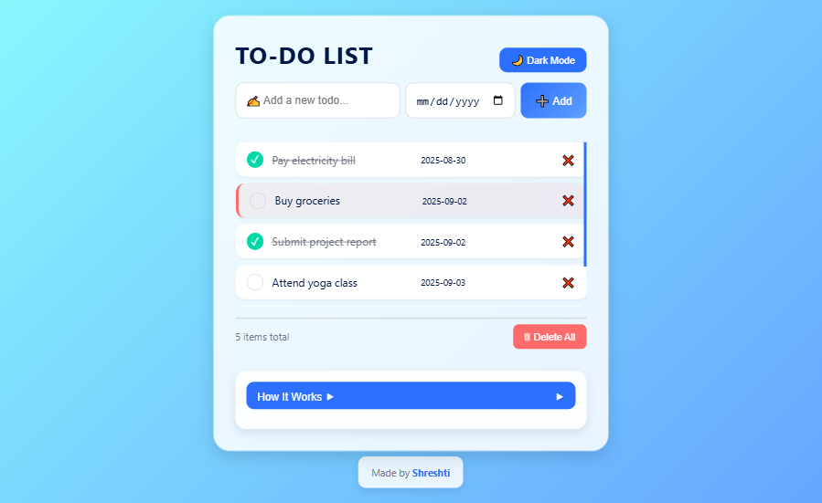
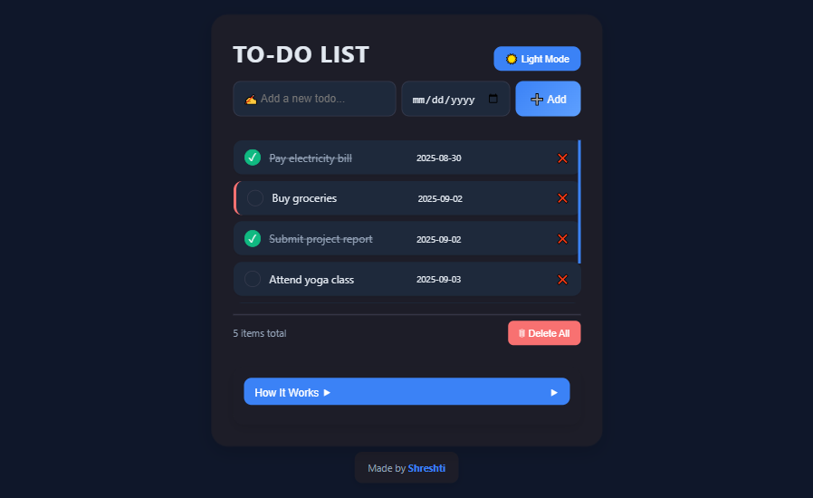
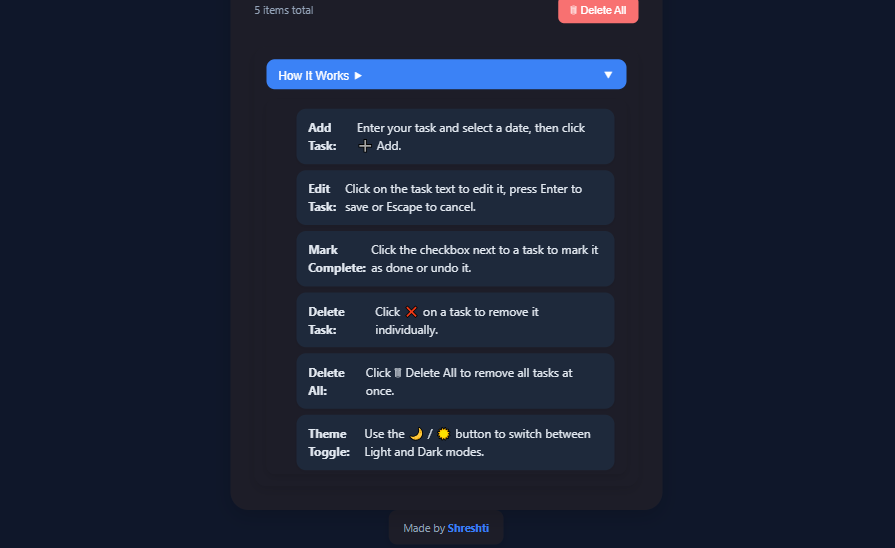

# To-Do App

A responsive and user-friendly To-Do List web app built with HTML, CSS, and JavaScript.  
It allows users to manage daily tasks with due dates, mark tasks as completed, and toggle between light and dark themes. Tasks are stored in the browser’s local storage, so your list persists even after refreshing.

---

## Features

- Add new tasks with a title and due date
- Edit existing tasks inline
- Mark tasks as completed or undo them
- Delete individual tasks or delete all tasks
- Highlight overdue tasks in red
- Toggle between Light and Dark modes
- “How It Works” section with instructions
- Responsive and modern design

---

## Screenshots

### Light Theme

### Dark Theme

### How It Works Toggle

---

## Example Tasks

| Task Name                     | Due Date     | Status         |
|-------------------------------|------------|----------------|
| Pay electricity bill           | 2025-08-30 | completed       |
| Buy groceries                  | 2025-09-02 | Pending        |
| Submit project report          | 2025-09-02 | Completed      |
| Attend yoga class              | 2025-09-03 | Pending        |
| Call friend for weekend plans  | 2025-09-03 | Pending        |

---

## How to Use

1. Enter your task and select a due date, then click **➕ Add**  
2. Click on a task to edit it; press Enter to save or Escape to cancel  
3. Use the checkbox to mark tasks as completed or undo them  
4. Click ❌ to delete a single task or 🗑 Delete All to remove all tasks  
5. Toggle Light/Dark mode using the button at the top  
6. Click “How It Works” to see a quick guide

---

## Technologies Used

- HTML5 – Structure and layout  
- CSS3 – Styling and animations  
- JavaScript (ES6) – DOM manipulation and local storage  

---

## Author

**Shreshti**  
Built using HTML, CSS, and JavaScript